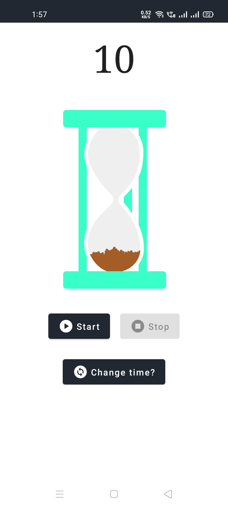
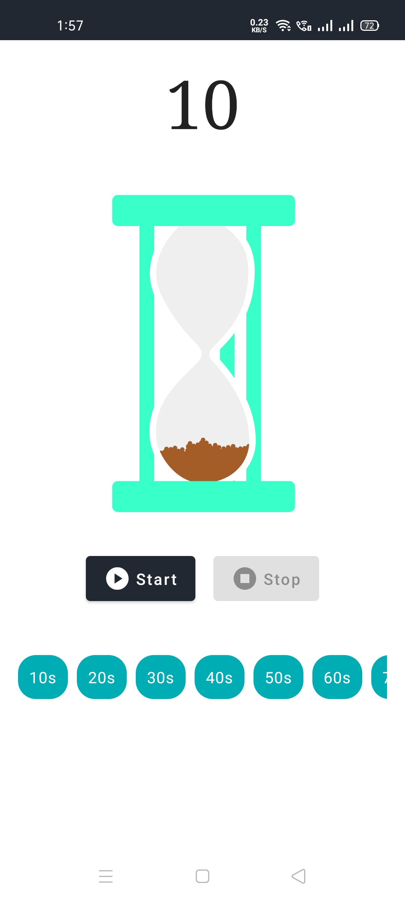
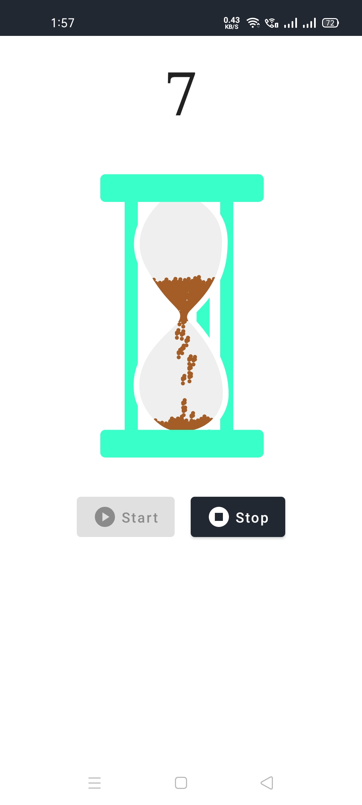

# TikKT ⌛


_**You can install preview application from here**_

[](https://github.com/PatilShreyas/TikKT/releases/latest/download/app-debug.apk)

## :scroll: Description

This is a simple Timer application built with Jetpack Compose for _#AndroidDevChallenge_.
It includes a sand timer animation for good look and feel.
The implementation includes use of Lottie Animation Library.

Animation Reference: https://lottiefiles.com/42981-sand-glass

## :camera_flash: Screenshots

You can watch video of the application [here](results/video.mp4)

Main | Choose Duration | Timer running
--- | --- | --- |
 |  | 

## 👀 Preview Run


## License
```
Copyright 2020 The Android Open Source Project

Licensed under the Apache License, Version 2.0 (the "License");
you may not use this file except in compliance with the License.
You may obtain a copy of the License at

    https://www.apache.org/licenses/LICENSE-2.0

Unless required by applicable law or agreed to in writing, software
distributed under the License is distributed on an "AS IS" BASIS,
WITHOUT WARRANTIES OR CONDITIONS OF ANY KIND, either express or implied.
See the License for the specific language governing permissions and
limitations under the License.
```